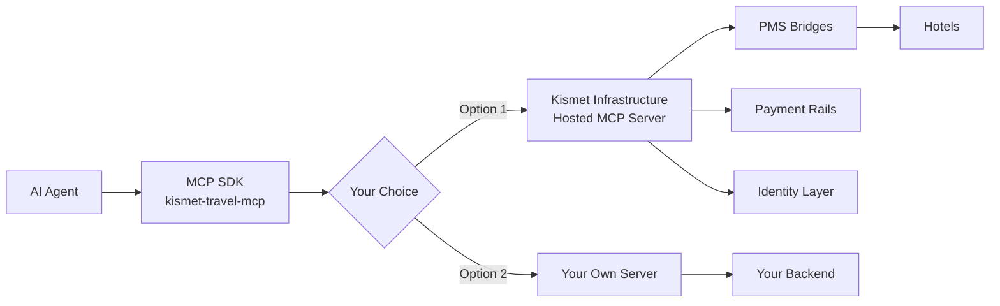

# .github

# 🏨 Kismet - AI-Ready Hotel Infrastructure

**Building the open rails for travel AI applications**

## 🚀 What We're Building

Kismet provides the foundational infrastructure that lets developers build AI-powered travel applications without wrestling with dozens of hotel APIs or PCI compliance. 

### Our Stack
- **Open Source MCP SDK** - Coming Q3 2025 ([Preview on npm](https://www.npmjs.com/package/kismet-travel-mcp))
- **Hosted Infrastructure** - Identity, payments, booking ledger, and MCP server
- **Bridge Network** - Direct integrations with PMS, POS, and event systems

## 📦 Public Packages

### kismet-travel-mcp (Preview Release)
[](https://www.npmjs.com/package/kismet-travel-mcp)
[](https://opensource.org/licenses/MIT)

Our Model Context Protocol (MCP) SDK for AI agents to interact with hotel systems. This package provides the MCP tools and protocol - use it with Kismet's hosted infrastructure or bring your own server. Currently in preview - full open source release planned for Q3 2025.

```bash
# Try it today
npx kismet-travel-mcp
```

## 🛠️ How It Works



### For Developers
- Build apps and keep 100% of your revenue
- Use our MCP SDK with Kismet's infrastructure or your own backend
- No gatekeepers - publish after passing conformance testing

### For Hotels
- Pay only on confirmed bookings (1.8% base + 2.9% for rules engine)
- Direct integrations with your existing systems
- Full control over rates and inventory

## 🌟 Featured Tools

Our MCP SDK provides Schema.org compliant tools for:
- `get_hotel_info` - Hotel details and amenities
- `check_availability` - Real-time room availability
- `get_room_rates` - Dynamic pricing and rates
- `create_reservation` - Secure booking creation
- `ask` - Natural language queries

## 🤝 Get Involved

### Developers
- 📚 [Documentation](https://docs.kismet.com) (Coming soon)
- 💬 [Join our Discord](https://discord.gg/kismet)
- 📧 Email: hello@makekismet.com

### Hotels & Partners
- Learn more at [makekismet.com](https://makekismet.com)
- Partner inquiries: partnerships@makekismet.com

## 🚧 Current Status

We're currently in private beta with select partners. Our repositories will become public as we approach the Q3 2025 open source launch.

### Roadmap
- ✅ MCP SDK (preview available)
- ✅ Core bridge integrations (Cloudbeds, Stayntouch, Opera Cloud, Mews, Tripleseat)
- 🚧 Comprehensive US hotel database
- 🚧 Developer portal and documentation
- 📅 Q3 2025: Full open source release

## 📄 License

Our open source components are MIT licensed. Bridge integrations remain proprietary for security and parity.

---

**The future of hotel tech is open, profitable, and developer-owned. Let's build it together.** 🏨✨
``` 
